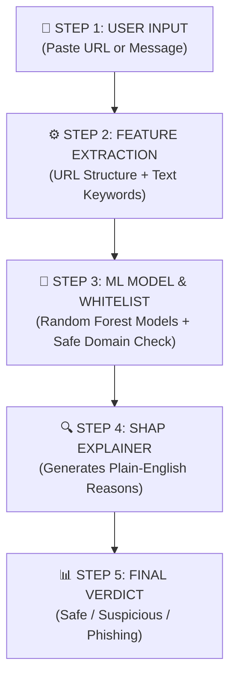

# 🛡️ TrustLens - Simple 1-Page Project Flowchart

Here is the simplified 5-step workflow for the **TrustLens Phishing Detection System**:

---

### 📋 5-Step Explanation:

1. **Step 1: User Input**
   - User inputs a web link or message text on the React threat console dashboard.
2. **Step 2: Feature Extraction**
   - Backend extracts 13 structural URL indicators (HTTPS, TLD, length, entropy) and text keywords via TF-IDF.
3. **Step 3: AI Analysis & Whitelist**
   - Dual Random Forest models calculate risk probabilities. Trusted domains (e.g., `google.com`, `sbi.co.in`) pass through whitelist protection.
4. **Step 4: Explainable AI (SHAP)**
   - SHAP feature attribution pinpoints exact risk factors and maps them into clear plain-English reasons.
5. **Step 5: Output & Storage**
   - Displays color-coded verdict (**Safe**, **Suspicious**, **Phishing**), safety advice, and saves scan history in MongoDB.
